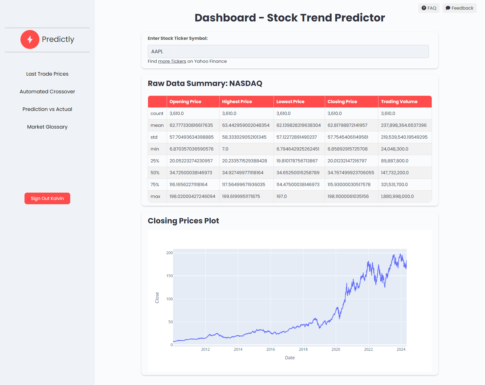
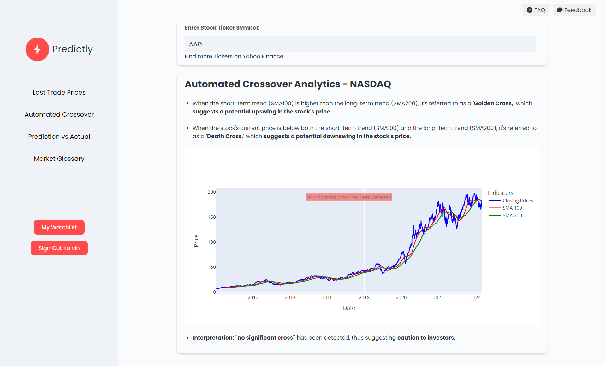
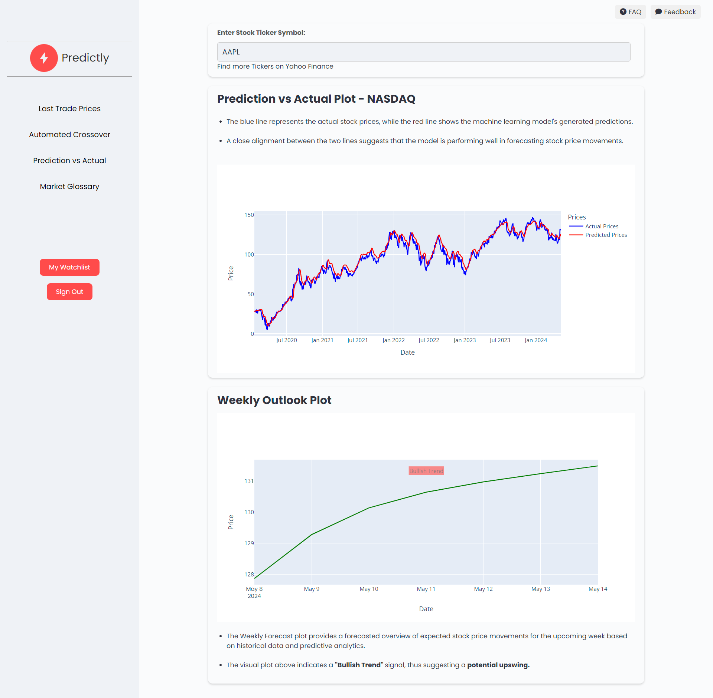
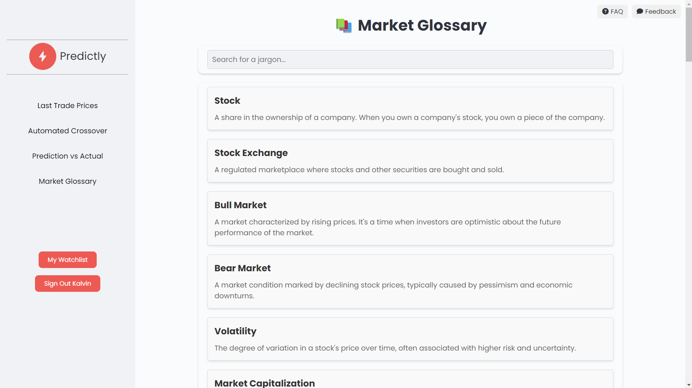

# Predictly: Stock Analysis & Prediction Web Application

Predictly is a powerful web application designed for in-depth stock price analysis and prediction, leveraging cutting-edge machine learning techniques. Here's a glimpse of its key features:

- **Last Trade Prices**: Displays the last trade prices for a given stock.
- **Automated Crossover**: Detects and displays golden/death crosses in stock prices.
- **Prediction vs. Actual**: Compares predicted stock prices with actual prices.
- **Weekly Forecast**: Provides a weekly forecast of stock prices.

## Installation Guide

Follow these simple steps to set up Predictly on your local machine:

1. Clone the repository:

   ```powershell
   git clone https://github.com/yourusername/Predictly.git
   ```

2. Navigate to the Project Directory:

   ```
   cd Predictly
   ```

3. Create and activate a Python virtual environment (optional but recommended):

   ```
   python -m venv venv
   venv\Scripts\activate
   ```
   - Use '. venv/bin/activate' if not installing on Windows.

4. Install the required dependencies:

   ```
   pip install -r requirements.txt
   ```

5. Create .env file at the root folder:
   ```
   echo "EMAIL_USE_TLS=True
   EMAIL_HOST='smtp.gmail.com'
   EMAIL_HOST_USER='<Your_Gmail_Address>'
   EMAIL_HOST_PASSWORD='<Your_Gmail_App_Password>'
   EMAIL_PORT=587

   DJ_SECRET_KEY='<Your_Django_Secret_Key>'" > .env
   ```
   - Note: For Gmail users, create an app password for the EMAIL_HOST_PASSWORD field.
     - Go to Gmail > Profile Icon > Manage your Google Account Security > 2-Step Verification > Create App (email sender) > App Password.

6. Migrate Database and createsuperuser
   ```
   python manage.py migrate
   python manage.py createsuperuser
   ```
   - Note: You will be prompted to enter your admin credentials. Follow the instructions to set up your superuser account.

7. Run the Django server:
   ```
   python manage.py runserver
   ```

8. Access the web app in your browser at http://localhost:8000/.

## Visual Overview

- **Last Trade Prices**:
  

- **Automated Crossover Analytics**:
  

- **Prediction vs Actual & Weekly Forecast**:
  

- **Beginner's Market Glossary**:
  

## Technology Stack

Predictly leverages the following technologies to deliver a seamless user experience:

- **Python Django**: A high-level Python web framework that encourages rapid development and clean, pragmatic design.
- **Plotly for interactive plots**: Plotly's interactive plots add a new dimension to data visualization, making it more engaging and insightful.
- **yfinance for stock price data**: Access up-to-date stock price data using the Yahoo Finance API, ensuring accurate analysis.
- **Tensorflow and Keras**: Utilizes TensorFlow and Keras for machine learning tasks, enabling advanced stock price prediction capabilities.

## License

This project is licensed under the GNU General Public License - see the LICENSE file for details.
